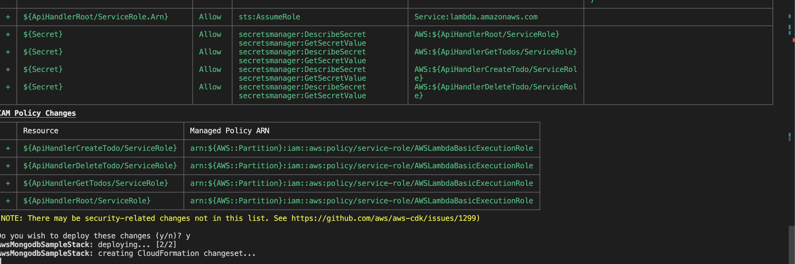

# Microservice Application with API Architecture for Startups

This is a reference architecture for API-based applications with AWS Amplify , MongoDB Atlas, APIGW, and Lambda

## [MongoDB Atlas](https://www.mongodb.com/atlas)

MongoDB Atlas is an all-purpose database having features like Document Model, Geo-spatial, TimeSeries, hybrid
deployment, and multi-cloud services.
It evolved as a "Developer Data Platform", intended to reduce the developer's workload on development and management of
the database environment.
It also provides a free tier to test out the application/database features.


## [AWS Amplify](https://aws.amazon.com/amplify/)

Amplify provides all the essentials for building full-stack web and mobile apps on AWS. Develop the frontend, incorporate features like authentication and storage, connect to real-time data sources, deploy, and scale to millions of users.

## [Amazon API Gateway](https://aws.amazon.com/api-gateway/)

Amazon API Gateway is a fully managed service that makes it easy for developers to create, publish, maintain, monitor,
and secure APIs at any scale.

## [Amazon Cognito User pool](https://aws.amazon.com/pm/cognito)

Amazon Cognito User pool helps you to deliver frictionless customer identity and access management (CIAM) with a
cost-effective and customizable platform. Helps you to add security features such as adaptive authentication, support
compliance, and data residency requirements. It can scale to millions of users across devices with a fully managed,
high-performing, and reliable identity store.

## Reference Architecture


## Sample output


1.  ## Prerequisites

    - Using the link, "Sign up" or "Sign in" for a [MongoDB Cloud account](https://www.mongodb.com/resources/products/platform/mongodb-atlas-tutorial#creating-a-mongodb-atlas-account) 

    
        
        
        Note: It is sufficient to setup only the MongoDB Cloud Account for Organizations and Projects. During the course of this demo setup, we build the a new Project, Cluster, and Database.


    - Create an [API Key in an Organization](https://www.mongodb.com/docs/atlas/configure-api-access/#create-an-api-key-in-an-organization) and grant project owner permission and open access (0.0.0.0/1) for this demo purpose. 

            Note: Please note this setting is not suitable for production environment and the access should be restricted based on your security policies.

    

    - Get the [AWS CLI](https://docs.aws.amazon.com/cli/latest/userguide/getting-started-install.html) Installed & Configured
    - Get the [AWS CDK](https://docs.aws.amazon.com/cdk/v2/guide/getting_started.html#getting_started_install) Installed & Configured
    - Get the [AWS AMPLIFY](https://docs.amplify.aws/gen1/react/tools/cli/start/set-up-cli/) installed for ReactJS & Configured


    - Set up the AWS environment variable


    ```bash       
    export AWS_ACCESS_KEY_ID="Enter the AWS Access Key"
    export AWS_SECRET_ACCESS_KEY="Enter the AWS Secret Access Key"
    export AWS_SESSION_TOKEN="Enter the AWS Session Token" 
    ``` 


    - Set up the [Python virtual](https://docs.python.org/3/library/venv.html) environment  

        - Python3 - `yum install -y python3`
        - Python Pip - `yum install -y python-pip`
        - Virtualenv - `pip3 install virtualenv`

    - Get the application code

        ```bash
        git clone https://github.com/mongodb-partners/Microservice_Application_with_MongoDBAtlas_AWSCDK_APIGW_Lambda.git
        cd aws_mongodb_sample_dir
        ```


    - We will use `cdk` to make our deployments easier. Let's go ahead and install the necessary components.


        ```bash
        # You should have npm pre-installed
        # If you DONT have cdk installed
        npm install -g aws-cdk
        ```

    - Set up the Python virtual environment

        **Make sure you are in the root directory**
    
        ```bash
        python3 -m venv .venv
        source .venv/bin/activate
        pip3 install -r requirements.txt
        ```
    - Set up the Python dependencies
        ```bash
        cd aws_mongodb_sample
        pip install --target ./dependencies pymongo
        cd ..
        ```
        
    - Verify the values for the Global Parameters [global_args.py](https://github.com/mongodb-partners/Amplify_APIGW_Atlas_for_startup/blob/main/aws_mongodb_sample_dir/global_args.py) and update as per your requirements.

    - Set up the secret key values and prerequisite roles and permission for MongoDB CDK.

        A. Login to AWS Console and run the [AWS CloudFormation template](https://docs.aws.amazon.com/AWSCloudFormation/latest/UserGuide/resource-import-new-stack.html) with the [profile-secret-role.yaml](https://github.com/mongodb-partners/Amplify_APIGW_Atlas_for_startup/blob/main/aws_mongodb_sample_dir/profile-secret-role.yaml) file. 


        
    
        This template creates secrets in the AWS Secret Manager to store the following:
    
        - MonogDB Atlas Organization ID

         

        - MongoDB Atlas Organization API credentials - Public Key and Private Key. 

         

        - MongoDB Atlas Database User Credentials - User Name and Password of your choice

        - AWS Account ID

        - The template also creates the role and permissions required to set up the MongoDB Atlas through AWS CDK

        B. Run the Python script [mongodb_prep_setup.py](https://github.com/mongodb-partners/Amplify_APIGW_Atlas_for_startup/blob/main/aws_mongodb_sample_dir/mongodb_prep_setup.py) to activate the Cloudformation registry - MongoDB (private) extensions with the appropriate role.

        ```bash 
        python mongodb_prep_setup.py
        ```


    - Set up the AWS CDK Bootstrap and check the CDK stacks - **AwsMongodbAtlasCreateStack**  & **AwsMongodbSampleStack** - are listed.
    

        ```bash       
        cdk bootstrap
        cdk ls
        ``` 

1.  ## Deploying the application


    ```bash
    cdk deploy --all
    ```

    Press "Y" to continue for deploying the AWS services

    

    Let us walk through each of the stacks,

    - **Stack: AwsMongodbAtlasCreateStack**

        This stack will set up the MongoDB Projects, Cluster, and Database. It will also set up the user access and network access to the database.
            
        **Side Note:** For this demo purpose, the network access is set to 0.0.0.0/0. This is not recommended for production environments.

          
    - **Stack: AwsMongodbSampleStack**

        This stack will create:

        a) Secret for storing ATLAS DB URI

        b) Cognito User Pool for API Authentication

        c) Lambda function that will create a database, insert dummy data, and return document count

        d) API Gateway backed by the lambda function created above

    After successfully deploying the stack, check the `Outputs` section of the stack to verify that all the resources are created successfully.


3.  ## (Optional) **Setup the Cognito user to check the access to the API Gateway Endpoint**

    Navigate to the Cognito user pool and copy the User Pool ID and Client ID (App Integration tab) from the Cognito User pool

    

    

    Open Cloud Shell and create a user with the command mentioned below:


    ```bash
    aws cognito-idp admin-create-user --user-pool-id  <YOUR_USER_POOL_ID>  --username apigwtest
    ```

    Force the user login through a secured password:


    ```bash
    aws cognito-idp admin-set-user-password --user-pool-id <YOUR_USER_POOL_ID>  --username apigwtest  --password <PASSWORD> --permanent
    ```

    Replace the User Pool ID and Client ID copied in the above step and also replace the username and password of the user
    created above:


    ```bash
    aws cognito-idp admin-initiate-auth --user-pool-id <YOUR_USER_POOL_ID> --client-id <CLIENT_ID>  --auth-flow ADMIN_NO_SRP_AUTH --auth-parameters USERNAME=apigwtest,PASSWORD=<PASSWORD>
    ```

    Copy the **Id Token** created from the above step and run the below command to test the API. Copy the API_GATEWAY_ENDPOINT
    from the API Gateway console --> API Gateway: APIs: ApiGateway (xxxxxx) :Stages:


    ```bash
    curl --location --request GET 'https://<API_GATEWAY_ENDPOINT>.execute-api.us-east-1.amazonaws.com/dev' --header 'Content-Type: application/json' --header 'Authorization: <ID_TOKEN>'
    ```


4.  ## Creating the frontend application

    Switch into the frontend project:


    ```bash
    cd frontend
    ```

    Add the URL you retrieved in the above test step to the atlas_for_startup/src/TodoList.tsx script:


    ```javascript
    const apiEndpoint = "https://XXXXXX.execute-api.us-east-1.amazonaws.com/dev/todos";
    ```

    First, you need to initialize Amplify. You can keep the default settings for this:


    ```bash
    amplify init
    ```

    Next, we need to add hosting to the project. Choose `Hosting with Amplify Console` and `Manual deployment`:


    ```bash
    amplify hosting add
    ```

    Whenever you make changes:


    ```bash
    amplify push
    ```

    Finally, we can publish the frontend:


    ```bash
    amplify publish
    ```

## **Clean up**

Use `cdk destroy --all` to clean up all the AWS CDK resources.

The Amplify backend and frontend need to be cleaned up manually.


## PrivateLink Setup

To set up the MongoDB Atlas cluster with PrivateLink, follow the steps from the [blog](https://aws.amazon.com/blogs/apn/connecting-applications-securely-to-a-mongodb-atlas-data-plane-with-aws-privatelink/). 

## Troubleshooting

Refer to [this link](https://github.com/mongodb/mongodbatlas-cloudformation-resources/tree/master#troubleshooting) to
resolve some common issues encountered when using AWS CloudFormation/CDK with MongoDB Atlas Resources.

## Useful commands

* `cdk ls`          lists all stacks in the app
* `cdk synth`       emits the synthesized CloudFormation template
* `cdk deploy`      deploy this stack to your default AWS account/region
* `cdk diff`        compares the deployed stack with the current state
* `cdk docs`        open CDK documentation

Enjoy!
